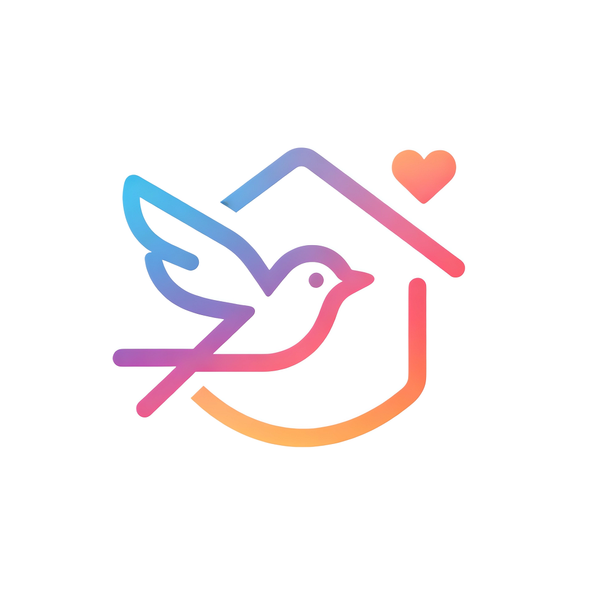

# 归巢 (NestBack)

<p align="center">
  <strong>物有归巢，心有所安</strong><br>
  <em>Nest your stuff, rest your mind</em>
</p>

<p align="center">
  
</p>

---

## 项目简介

归巢（NestBack）是一款**本地优先**的家庭收纳管理应用，采用 BYOK/BYOB（Bring Your Own Key/Bring Your Own Backend）极客架构设计。核心哲学是：**"本地是基石，云端是插件；数据绝对主权，交互极致丝滑"**。

未配置任何第三方服务时，App 依然是一个功能完善的单机版收纳工具。用户可按需接入 AI 识图、云端同步、冷备灾备等高级功能。

## 下载安装

### 下载链接
- [GitHub releases](https://github.com/wxnan/nestback/releases)
- [百度网盘](https://pan.baidu.com/s/1xAmufnzGhy4003HOZwd69Q?pwd=7ycp) （密码：7ycp）
- [蓝奏云](https://dawnan.lanzoum.com/b032dvmk6j) （密码：2jec）

### 下载说明

- 加速下载：可选择 Github Proxy 加速下载。例如：[https://github.akams.cn/](https://github.akams.cn/)、[https://gh-proxy.com/](https://gh-proxy.com/) 等代理加速网站。
- apk选择：根据设备架构选择对应的 apk 文件，注：大部分设备支持 arm64-v8a 架构。
- ipa文件：仅提供 Runner.app.zip 文件和 Runner.ipa 文件，且未在苹果设备上测试，用户需自行解决签名问题。

## 核心功能

### 📦 物品管理
- **多家庭支持**：支持创建和管理多个家庭空间
- **层级空间**：无限层级的空间结构（房间 → 柜子 → 盒子）
- **智能录入**：支持 AI 识图、AI 聊天、扫码录入、手动录入四种方式
- **滑动手势**：左滑复制/拆分，右滑消耗/补货
- **过期提醒**：自动追踪物品保质期，提前预警
- **标签分类**：灵活的分类和标签系统

### 📊 数据统计
- 物品总数、总价统计
- 过期/即将过期预警
- 库存不足提醒
- 等待估值物品追踪
- 多维度饼图分析（按分类/房间/标签/成员）

### 🔧 极客功能
- **AI 接入**：支持 OpenAI/国产大模型/本地 Ollama
- **云端同步**：Supabase 实时同步（可选）
- **冷备灾备**：WebDAV 加密备份（坚果云等）
- **扫码识别**：ML Kit 本地条码识别 + 自定义商品 API

## 应用截图

### 首页


### 空间


### 录入


### 统计


### 我的


## 技术栈

| 模块 | 技术选型 |
|:-----|:---------|
| 前端框架 | Flutter |
| 本地数据库 | SQLite + Drift (ORM) |
| 状态管理 | Provider |
| 图表统计 | FL Chart |
| 手势交互 | Flutter Slidable |
| 扫码识别 | Mobile Scanner (ML Kit) |
| 本地通知 | flutter_local_notifications |
| 数据导入导出 | CSV + Archive |

## 项目结构

```
lib/
├── database/           # 数据库定义 (Drift)
├── pages/
│   ├── home/          # 首页模块
│   ├── space/         # 空间管理
│   ├── add/           # 录入模块
│   ├── stats/         # 统计模块
│   ├── profile/       # 个人中心
│   ├── item/          # 物品详情
│   └── notification/   # 通知页面
├── providers/          # 状态管理 (Provider)
├── services/           # 业务服务
│   ├── barcode_service.dart      # 条码服务
│   ├── notification_service.dart # 通知服务
│   └── import_export_service.dart # 导入导出
└── utils/              # 工具类
```

## 数据模型

- **Houses**：家庭/房屋
- **Spaces**：空间（支持无限层级）
- **Items**：物品
- **Categories**：分类
- **Subcategories**：子分类
- **Tags**：标签
- **Attributes**：自定义属性
- **AppNotifications**：应用通知

## 开发路线

- [x] Phase 1：单机基石 - 数据库、多家庭、层级空间、手动录入
- [x] Phase 2：数据透视 - 分类/标签/属性管理、统计图表
- [ ] Phase 3：极客底座 - WebDAV 备份、配置管理
- [ ] Phase 4：AI 魔法 - LLM 接入、AI 识图/聊天录入
- [ ] Phase 5：云端协同 - Supabase 同步、多成员协作

## 开发功能

### 已完成功能

- [x] 支持手动录入功能
- [x] 支持扫码录入功能
- [x] 支持滑动手势快速操作
- [x] 支持过期提醒功能
- [x] 支持日均成本功能
- [x] 支持物品添加图片、空间（容器）添加图片功能
- [x] 支持空间层级管理功能
- [x] 支持数据统计功能
- [x] 支持多家庭管理功能
- [x] 支持自定义分类、属性、标签功能
- [x] 支持导入导出功能

### 待完成功能

- [ ] 支持AI识图功能
- [ ] 支持AI聊天功能
- [ ] 支持WebDAV备份功能
- [ ] 支持实时同步功能
- [ ] 支持家庭协作功能

## 文档

详细文档位于 `docs/` 目录：

- [设计方案](docs/设计方案.md) - 完整的产品设计与技术方案
- [使用帮助](docs/使用帮助/) - 用户使用指南
- [API说明](docs/API说明/) - 接口文档

## 许可证

本项目采用 AGPL 3.0 协议开源。

---

<p align="center">
  Made with ❤️ by NestBack Team
</p>